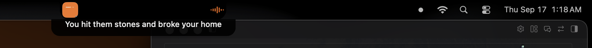

# notch-lyrics

The current lyric line, always visible under the MacBook notch.



Notch apps do show synced lyrics — but only inside the expanded panel, behind a
hover and a tab. Vorssaint's resting notch is `none | battery | music`, with no
lyrics case at all, and Sapphire is the same. This draws its own strip instead,
so the line is simply there.

## How it works

- Track, position and play state come from Spotify over AppleScript, polled 4×/sec
- Synced lyrics come from [LRCLIB](https://lrclib.net), matched on artist, title,
  album and duration, parsed from LRC (including lines carrying several timestamps)
- The strip is a borderless click-through window pinned under the notch, joining
  all Spaces, with no Dock icon and no focus

It hides itself when playback pauses and when a track has no synced lyrics — it
never shows a stale line.

## Install

```bash
./build.sh                 # builds NotchLyrics.app
./install-login-item.sh    # start at login, restart if it exits
```

macOS asks once for permission to control Spotify. Remove it again with
`./uninstall-login-item.sh`.

## Options

```bash
NotchLyrics --offset -0.4   # shift lyric timing, in seconds
```

`NOTCH_LYRICS_DEBUG=1` prints the frame and text of every layout pass, and
`NOTCH_LYRICS_DROP=<points>` shifts the strip further down the screen.

## Notes

Two things that cost time here, in case they save you some:

**Measure the field, not the string.** `NSString.size(withAttributes:)` ignores
the cell insets `NSTextField` draws inside, so a string-derived width is a few
points short and silently truncates the last word. `label.fittingSize` is right.

**Keep out of the status-window level band.** Vorssaint's notch counts any
window with layer in `[statusWindow, statusWindow+1]` that is narrower than the
screen and no taller than the menu bar as menu-bar occupancy — with no check on
where it actually sits vertically. A strip at `.statusBar` costs it the "safe
center" and it hides its own album art and audio pill entirely, anywhere on
screen. Sitting two levels above leaves it alone.

**Don't leave `autoresizingMask` on the label.** The plate resizes on every line
change, and autoresizing re-derives a label width that truncates the text — even
after the window frame is correct.

## License

MIT
